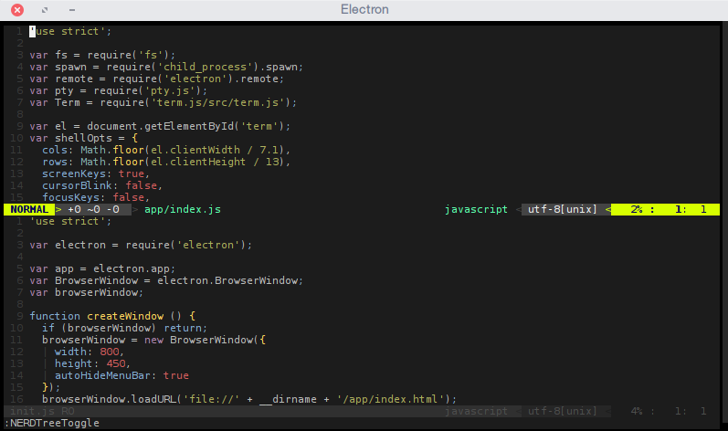

# aterm
> electron TTY terminal

##### Proof of concept for running a full TTY terminal in electron.

## Usage
`$ npm start`

this will start electron and spin up the application

fish shell

another example, running neovim

contributions welcome :)

## MIT
